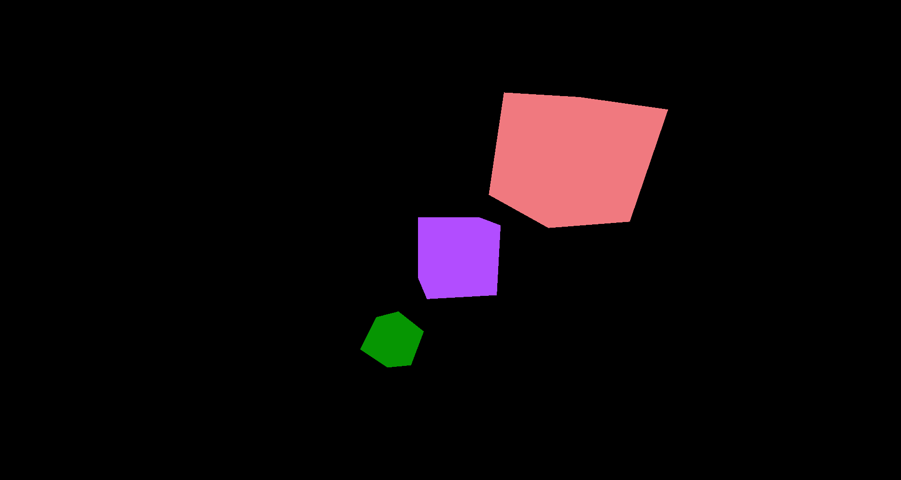
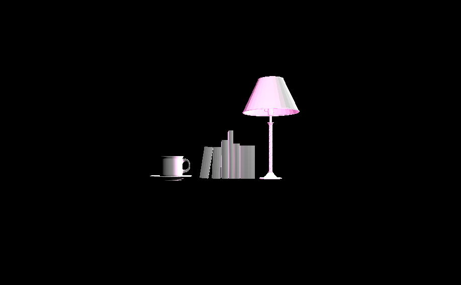
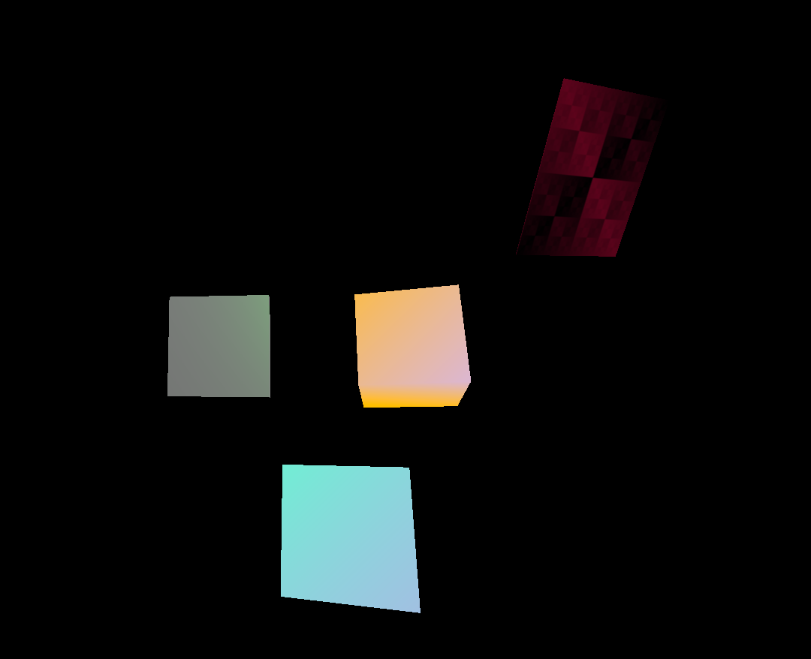

# CMPM163Labs
 
 Note: Video link can be found at bottom.
 
 Testing for alt. way of uploading pics:

Screenshots:

Link to video:
https://drive.google.com/file/d/1jjSBs7wMQEc73ecK3Vb8ikRhOYAnilbD/view?usp=sharing

Lab 3

Link to video: https://drive.google.com/file/d/12J9EPF8xuRI9jvutwWYIb-OVwM2H2WnF/view?usp=sharing

Screenshots:

For lab 3, my first cube (cube) to the left is the default project one. It is just a cube that is using the three.js material.

The second cube (cube1) to the left, is the other tutorial example and is a a blue/purple shader cube. It colors change depending on it's location in the window, which changes because of the rotation, leading to it having a constant color change (stemming from the uniform lines we put in the lab3.html and the fragmentShader.frag files. 

The third cube (cube4), is the orange/purple cube which uses a custom shader I made, also using the points in the world (and due to rotation) changes colors. 

Finally, we have the last cube to the very right (cube2), which has a variety of effects, using: shininess, texture function (which I referenced off of the three.js site and have credited in my file) and is a red gradient consisting of many smaller squares, transparency, and color.  
