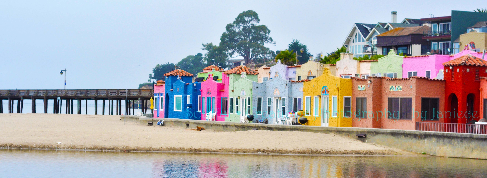
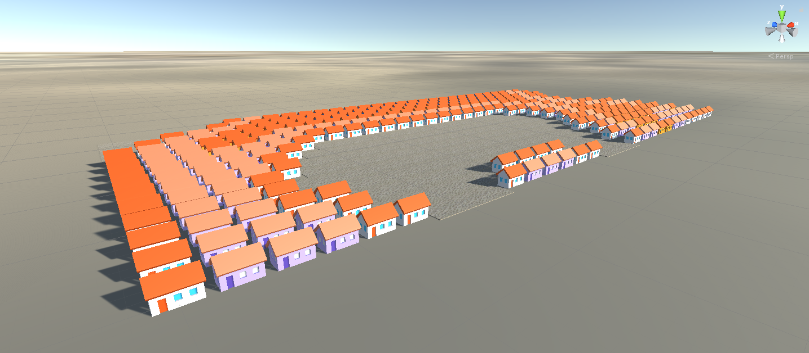
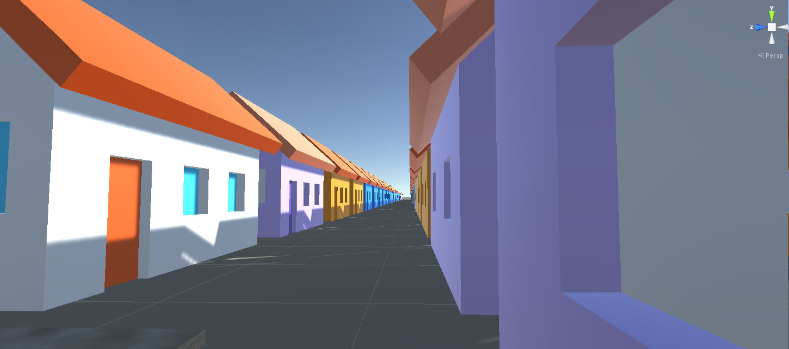

# CMPM163Labs

Benjamin Tran
 
 Note: Video link can be found at bottom.
 
 Testing for alt. way of uploading pics:

Screenshots:

Link to video:
https://drive.google.com/file/d/1jjSBs7wMQEc73ecK3Vb8ikRhOYAnilbD/view?usp=sharing

Lab 3

Link to video: https://drive.google.com/file/d/12J9EPF8xuRI9jvutwWYIb-OVwM2H2WnF/view?usp=sharing

Screenshots:

For lab 3, my first cube (cube) to the left is the default project one. It is just a cube that is using the three.js material.

The second cube (cube1) to the left, is the other tutorial example and is a a blue/purple shader cube. It colors change depending on it's location in the window, which changes because of the rotation, leading to it having a constant color change (stemming from the uniform lines we put in the lab3.html and the fragmentShader.frag files. 

The third cube (cube4), is the orange/purple cube which uses a custom shader I made, also using the points in the world (and due to rotation) changes colors. 

Finally, we have the last cube to the very right (cube2), which has a variety of effects, using: shininess, texture function (which I referenced off of the three.js site and have credited in my file) and is a red gradient consisting of many smaller squares, transparency, and color.  

Lab 4

Link to video: https://drive.google.com/file/d/17A953AsObiHzVlbc3WoureU_lbcrYred/view?usp=sharing

Step 24 - Questions: 

a) What is a formula to get the x coordinate of the texture given a u value of the uv coordinate (a value between 0 and 1)?

x = floor(7u)

b) What is a formula to get the y coordinate of the texture given a v value of the uv coordinate (a value between 0 and 1)?

y = floor(7*(1-v))

c) What color is sampled from texture at the uv coordinate (0.375, 0.25)? (sample from the image based on the number your formula gives you i.e. (1, 0) (x, y) is blue)

(0.375, 0.25) = (2, 5)
so, x = 2 and y = 5, meaning the color that is sampled is: gray (light gray)

/* 

	Cube 1: 
	Currently has a wood patterned-texture map, which includes texture and a normal map [middle]
	- Part 1 Texture A & Normal Map A

	Made by creating new variables: geometry, texture (loads image), normMap (loads normal map, giving features to surface). Then combined texture and normal map with var material = new THREE.MeshPhongMaterial( { map: texture, normalMap: normMap } );. Next, created a cube with this new material on and added to scene.

	Cube 2:
	2nd cube was made exactly the same as above, just didn't have a normal map included, so only see texture (same texture as Cube 1). It reused geometry and texture.

	Cube 3:
	Cube 3 got many new variables, but did reuse the same methods as Cube #1, just implemented a new Texture and a non-matching Normal map (unlike Cube 1).

	Cube 4 & 5:
	Is part 2 Texture C of assignment 4, sporting with it, a new shader with a new texture. This cube isn't affected by light as we didn't tell it to be in function. Cube 4 and 5 were created in function addTextureShaderCube(). The count is to 3, because loading in 3 files: 2 fragmentShader and 1 vertexShader files. Everytime a type of these files is brought in, count goes up and stops at 3. At the very bottom, we have our loader files, which load in the effect and show to console if there's an error and/or if it has processed the file.

	For Cube 4, fragmentShader.frag file is the shader that is used on Cube 4.

	We reuse vertexShader throughout all the cubes.

	Cube 5: 

	- fragmentShader(2) file:
	vUv ranges from 1*2, so when multiply anything under 2.0, the last pixel gets streched, making the remaining parts of the cube covered by the last column of pixels (which get stretched, as they have to cover the end of the face. This is why we multiply vUv so the range is from 0 to 2.) We know that the tile face is on a 1x1, so we use mod(scaleUV and divide it by 1.0). This ensures that that the fragment Shader will keep outputting things until it reaches the other side, meaning no more remainders. gl_FragColor is just putting the right colors onto the right spots.

*/

Lab 5

Video link: 

https://drive.google.com/file/d/12L0UZt530aoj7owqed3Nz4fajm3N8Oes/view?usp=sharing

Screenshots:

In Lab 5, I changed/added a lot to the game. I first created the tire particles using the Youtube tutorial. Then, I used a new material (using the cloud particle map) and messed around with many of the same properties as the first one (color, lifespan, emission rate, etc.) to create the smoke effect from the emission pipe. But, I did use new properties, as I looked at the smoke example from the author's particle effect pack and used the same properties they used, adjusting it to suit mine (leaving a trail behind). 

Next, I proceeded to add more to the world, making the checkpoint rings much more interesting, adding the rainbow particle effect that was used in the particle pack. I altered rainbow particle's shape to be a circle and changed it's emission rate and lifespan to get the desired effect. Then, I moved the firework effect over to this scene, adding them to the sides of each circle. For both the rainbow and the fireworks, I made them children of each ring, so when the player passes through a ring, the particles will disappear as well. Also, for the checkpoint rings I changed the rings to a light yellow color to have better color cohesion a night-time setting.

Next, I created a halo that stays on top of the players head, and it emits some light particles to make it seem more angelic. And when the player drives, the halo emits a trail of particles, which I think adds a nice touch.

Wanting to extend the angel theme further, I made the skybox more blue (instead of the orange base) to simulate a night-time feel and changed the sun's color to reflect the moon's colors instead (also giving it less opacity for a lighter glow).

I also made the finish line post all white instead of red, as I thought the red gave the game too harsh of a feeling. I wanted the night-time theme to invoke more of a peaceful, yet some urgency vibe.

I think my favorite addition has to be the stars I added, using the semi-hemisphere, to create a realistic placement of stars that are layered to give it a look of realism and different distances. 

Alongside this, I changed the player model to a white base color, matching the rings and the night aesthetics. I think the setting fits much better now.

Finally, I added a title (Moondrive) to the title screen and changed the background clipart, adding a filter to make the scenes look like it's at night to fit with the "main scene". 

Lab 6

Video Link: https://drive.google.com/file/d/1gin1WLEJbF1rwC7K1qSf0O6SYfnRdmp4/view?usp=sharing

Lights:
In my Unity scene, I used 3 spot lights, an area light, and a directional light. I was going for an evening time of day where the lamps have just turned on in preperation for the night. 

Point lights start with a center point and a range, which determines how far light gets sent out from that origin point, in all directions (spherically) equally.

A spotlight is a type of lighting that has a location and range that tells the angle and direction a light should be shown, creating a cone-shaped glow. The light diminishes as it gets further away from the initial point.

An area light starts as a 2d rectangle, where light is emitted equally from all parts of only one side of it. Need to be baked into the lightmaps, as is quite intensive.

Directional lights are like the sun, where they act like a distant light source which can be positioned anywhere in scene, as it doesn't have a single defined location. All objects in scene are illuminated from same direction and strength, no matter where they are placed in the scene. 

Material: 

Note: I converted my scene from daytime to nighttime! Also here, you can see how my objects looked like before I put texture maps on them.

For my material, I wanted to replicate my dark blue notebook's cover. I first created a material and then imported my car asset and put it in the scene. Next, I proceeded to match the material's color to my notebook and placed onto the car and then proceeded to tune the material until it resembled my notebook's cover. To make it look more plastic-like, I increased the smoothness, to give it more of a sheen. 

Gameplay

Textures:
Next, for my textures, I made three of them: one for my grass, one for the house, and one for the road. First I created materials for each one of the desired material (3 in total). Then, I put each normal map and jpg of each texture (I used the textures provided from lab 4) into the lab folder. Afterwards, I put the color jpg picture into the base map, while for my normal map, I put in the texture's normal map. Then I just put each texture onto the desired object. I played around with tiling on all of them to make them look more organic.

Lab 7: Mesh Manipulation (Mountains and Lake)

Video link: https://drive.google.com/file/d/153_Y-cl7dS_fg4b9eFuiNLmqWSDBSlIt/view?usp=sharing

For Lab 7, I chose to do part 1 - Unity Mesh Manipulation.

In this assignment, I expanded my map and made new terrain, one that would support the water mesh that I created. 

For the mountains I used the shader graph effect that I created (using the Unity Learn Shader Graph: Vertex Displacement as reference) and then applied the effect to a plane, which warped it appearance to look hill-like. But the problem is that it only gave the top the shape, leaving the output like an outline of a mountain range. By rotating the figure along the y-axis, the whole top area that was once smooth, all became bumpy and spiky, which made it look like a mountain range now. Then I duplicated it twice to layer it, giving a sense of depth. I duplicated these layers two more times because the mountain range was too small on my map; not wanting to mess with the distortion I had created, I just replicated the whole thing. The cool thing is that when I moved it along each way of the x-axis, it changed it's shape, so each area of my mountain range looks unique. 

Next, is the water shader I created (using Dapper Dino's "Writing Shadeers In Unity..." as reference). I wanted the water to look like a 3D lake, so I hollowed out the land and then proceeded to put the 2D shader on a material, then the material on a plane, and then placed it inside the hole, but at the top to create a visual illusion. 

Then, having finished the tutorials, I adjusted the props (all of which I made) to look in place with the new terrain. So, I expanded the land, placed more trees, cars, lamps around; even making new color sets for some variety. Alongside this, I made new cloud assets to give the mountains some sense of height. 

Partner report (Lupin Tu): 

My partner Lupin did part 1. Here was his response to the questions: 

"I did part 1 as well, and the most challenging part is mountain part, which I still quite confusing about, most interesting part is mountain as well, simply b/c water part is more confusing, and I had to find some other tutorial to learn. So the challenges I encountered from mountain tutorial is to make mountain top rounded, the tutorial is pretty irrelevant to mountain mesh, which is why it is so challenging."

Lastly, we didn't help each other during this lab.

Lab 8

Video Link: https://drive.google.com/file/d/1ERLyl1Mkr9a7902CDlJ3x6xTvrOCATlh/view?usp=sharing

For lab 8, I chose to do part 1, using Unity to create a procdural city.

i. For Lab 8, I was inspired by Capitola's colorful beach houses. I even visited them in the past.

ii. Screenshots: 

iii. Having been to the beach of Capitola and seeing these houses, it was a work of art and one of the coolest towns  I've ever witnessed. When thinking of a place that inspired me the most, it was this place. Because the beach and the color just combine to give it a sense of life. 

In an attempt to replicate this, I replaced the building models from the tutorial with my own house assets, which I used made for the previous assignments. I recolored them for this assignment using Capitola buildings I had photos of as reference. I also, downloaded a sand texture to use for the ground. Then I adjusted what I divided the Perlin Noise by until I was satisfied. Finally, I made the map size smaller (30x15), as Capitola's beach town wasn't that big. 

Here's my work from the tutorial:

Video Link: https://drive.google.com/file/d/1F5KLY8vMZ3Pcwd1CMUAWz0r9Dx8JsRLS/view?usp=sharing

Screenshots:

iv. Partner's response (Cole Watts): 

"I recolored the buildings and added more variance with the heights. I also added spikes on only the tallest buildings to resemble the New York skyscrapers"

v. We didn't help each other during the lab. Just checked in with each other.

